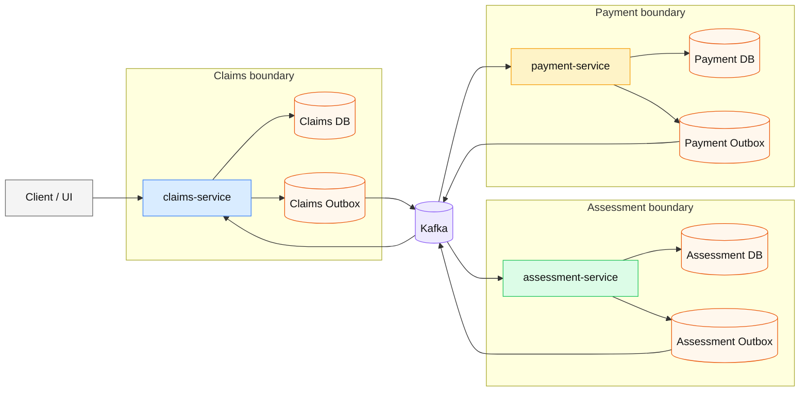

# Insurance Claims Processing System
## Project Idea

`insurance-claims-processing-system` is part of a distributed insurance claims system. In this system, we need:
- delivery guarantee between services;
- stable work when one part has a problem;
- clear and correct claim status changes.

Main goal: do not lose business events and keep the payment process consistent, even when some components fail.

## What I build

An event-driven architecture with three domain services:
- `claims-service` - receives claims, stores status, publishes first events;
- `assessment-service` - reviews a claim and makes a decision (human-in-the-loop);
- `payment-service` - starts and records payment.

Main architecture principles:
- Outbox Pattern for reliable event publishing;
- Saga (choreography) for cross-service business flow;
- idempotent event handling for duplicate protection.

## Basic Flow

### Components flow

### Business Flow

_This flow is currently in development and may change._

`SUBMITTED -> UNDER_ASSESSMENT -> ASSESSED -> PAYMENT_PENDING -> PAID`

Possible alternative branches:
- claim is rejected (`REJECTED`);
- payment has an error (`PAYMENT_FAILED`) with a compensation flow.

## Planned Development Stages

- [ ] Architecture concept and project scope are defined
- [ ] Stage 1: `claims-service` (API + storage + outbox)
- [ ] Stage 2: `assessment-service` (review and underwriter decision)
- [ ] Stage 3: `payment-service` (payment + duplicate protection)
- [ ] Stage 4: Connect services into end-to-end Saga flow
- [ ] Stage 5: Integration tests (Testcontainers)
- [ ] Stage 6: Observability and metrics (Prometheus/Grafana)

## Current Status

The project is in active development. This document shows the target direction and near steps, not a final production implementation.
